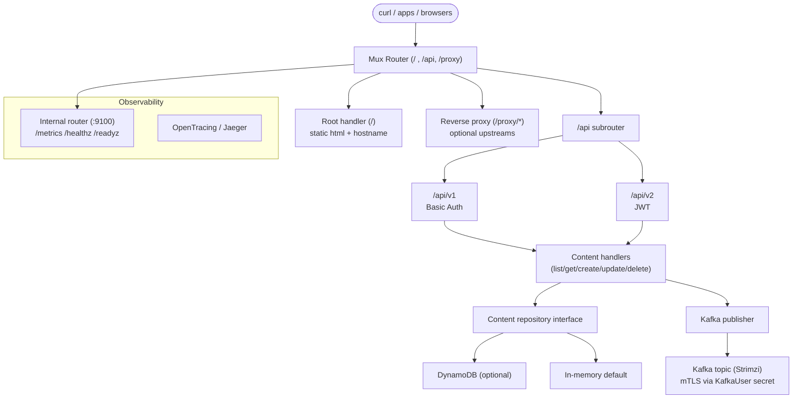

# go-helloworld

Simple Go REST API service demonstrating best practices for HTTP routing, metrics, tracing, and basic auth/JWT. It exposes:
- Root handler returning a message and hostname
- REST API under `/api` with basic auth (`/v1`) and JWT (`/v2`)
- Prometheus metrics on `/metrics` (internal port)
- Optional reverse proxy routes under `/proxy`

This repo includes a Helm chart for [Kubernetes deployment](./deploy/README.md).

## DynamoDB Backing Store

The REST API can persist content in AWS DynamoDB. When the following environment variables are supplied, the service uses AWS STS to obtain short-lived credentials (either via `AssumeRole` or `AssumeRoleWithWebIdentity`) before creating the DynamoDB client:

- `DYNAMODB_TABLE` – table that stores the content items (`id` as the partition key)
- `AWS_REGION` (or `AWS_DEFAULT_REGION`) – target AWS region
- `AWS_ROLE_ARN` – IAM role to assume for data access
- `AWS_ROLE_SESSION_NAME` *(optional)* – explicit session name for the STS call
- `AWS_WEB_IDENTITY_TOKEN_FILE` *(optional)* – enable IRSA by providing the projected token path
- When using the bundled Helm chart, you can supply `dynamodb.serviceAccountTokenProjection.*` values to mount a projected service account token with a custom audience (defaults align with EKS IRSA conventions).

If any of the required values are missing, the application logs a warning and falls back to the in-memory seed data (handy for local development and tests).

## Kafka Publishing

When Kafka settings are supplied the service emits every newly created content record (JSON encoded) to the configured topic. Set the following environment variables:

- `KAFKA_BROKERS` – comma-separated broker list such as `broker-1:9092,broker-2:9092`
- `KAFKA_TOPIC` – destination topic to produce events to
- `KAFKA_CLIENT_ID` *(optional)* – custom Kafka client identifier (defaults to the service name)

If either brokers or topic are omitted the producer stays disabled and the API continues to operate normally.

For Strimzi-managed clusters that require mutual TLS (mTLS), provide the PEM files emitted by the `KafkaUser` secret:

- `KAFKA_TLS_ENABLED=true`
- `KAFKA_TLS_CA_FILE` – path to the CA bundle (for Strimzi secrets: `<mount>/ca.crt`)
- `KAFKA_TLS_CERT_FILE` – client certificate path (usually `<mount>/user.crt`)
- `KAFKA_TLS_KEY_FILE` – client private key path (usually `<mount>/user.key`)

The Helm chart exposes matching knobs under `kafka.*` and `kafka.tls.*` to mount the `KafkaUser` secret and set these environment variables automatically. See [`deploy/strimzi`](./deploy/strimzi) for an end-to-end example that creates the `KafkaTopic` and `KafkaUser` via Strimzi before installing the application chart. Because topic lifecycle is managed by Strimzi, the application expects the topic to exist ahead of time (auto-topic-creation is disabled).

## Architecture Overview



Requests enter through Gorilla Mux, are authenticated (Basic or JWT), and routed to the content handlers. Each create call persists through the repository (DynamoDB when configured, otherwise the in-memory store) and emits a JSON payload to Kafka. Metrics and health handlers stay on the internal port, and tracing spans are sent to Jaeger-compatible collectors.

## Local Development

Build the container from repo root:

```bash
docker build -f build/docker/Dockerfile -t ghcr.io/berndonline/k8s/go-helloworld:dev .
```

Run locally:

```bash
docker run --rm -p 8080:8080 -p 9100:9100 ghcr.io/berndonline/k8s/go-helloworld:dev
```

## Usage with curl

Below are examples to exercise the service locally (assuming it’s running with `-p 8080:8080 -p 9100:9100`).

### Root handler

```bash
# Default greeting + hostname
curl -sS http://localhost:8080/

# Customize response message via env var when starting the container
# docker run -e RESPONSE="Hello from curl" -p 8080:8080 -p 9100:9100 ghcr.io/berndonline/k8s/go-helloworld:dev
curl -sS http://localhost:8080/
```

### Health, readiness, and metrics (internal port)

```bash
curl -sS http://localhost:9100/healthz
curl -sS http://localhost:9100/readyz
curl -sS http://localhost:9100/metrics | head -n 20
```

### API v1 (Basic Auth)

```bash
# List content
curl -u user1:password1 http://localhost:8080/api/v1/content

# Get single item
curl -u user1:password1 http://localhost:8080/api/v1/content/1

# Create content
curl -u user1:password1 \
  -H 'Content-Type: application/json' \
  -d '{"id":"3","name":"Content 3"}' \
  http://localhost:8080/api/v1/content

# Update content
curl -u user1:password1 \
  -X PUT -H 'Content-Type: application/json' \
  -d '{"name":"Updated 3"}' \
  http://localhost:8080/api/v1/content/3

# Delete content
curl -u user1:password1 -X DELETE http://localhost:8080/api/v1/content/3
```

### API v2 (JWT)

```bash
# Login and store cookie
curl -i -c cookie.txt \
  -H 'Content-Type: application/json' \
  -d '{"username":"user1","password":"password1"}' \
  http://localhost:8080/api/v2/login

# Use token cookie to list content
curl -b cookie.txt http://localhost:8080/api/v2/content

# Refresh token (updates cookie)
curl -b cookie.txt -c cookie.txt -X POST http://localhost:8080/api/v2/refresh

# Logout
curl -b cookie.txt -c cookie.txt -X POST http://localhost:8080/api/v2/logout
```

### Reverse proxy routes (optional)

The app exposes optional proxy endpoints under `/proxy`. These forward to upstream hosts defined in `internal/app/proxy.go` and are primarily intended for in-cluster use where the upstream DNS names resolve.

```bash
# Example (requires in-cluster DNS):
curl -sS http://localhost:8080/proxy/helloworld
```

## Repository Layout

- `cmd/helloworld`: app entrypoint
- `internal/app`: server, api, auth, metrics, tracing, proxy
- `web/static`: static assets
- `build/docker/Dockerfile`: container build
- `deploy/charts/helloworld`: Helm chart
